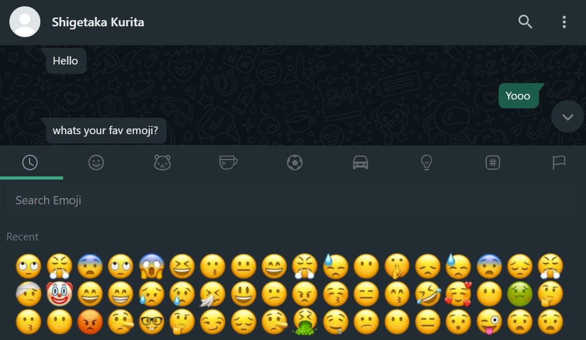
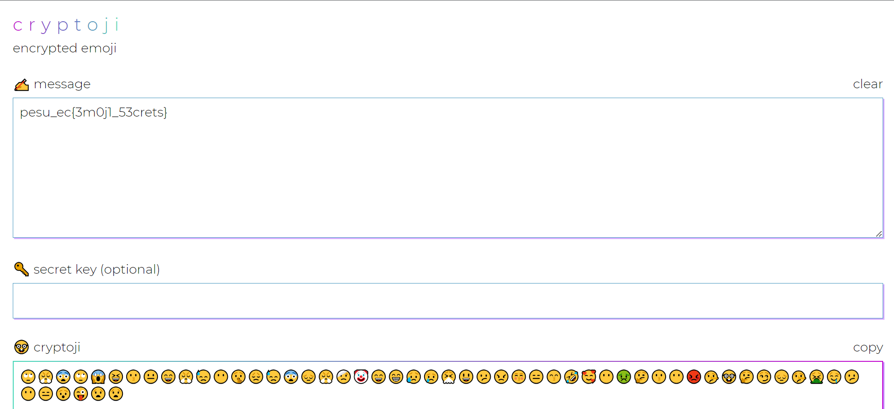

# Emoji Man
> Solves - 40

## Description
Someone asked me my favorite emojis

🙄😤😨🙄😱😆😗😐😄😤😓😶🤫😞😓😨😔😤🤕🤡😄😁😥😢🤧😃😕😠😚😑😙🤣🥰😶🤢🤔😗😶😡🤥🤓🤔😏😔🤥🤮🤤😕😶😑😯😜😧😧

#### Added later due to low solves
> Are those some `CRYPTic emOJIs` ?

## Files Attached

## Solution
- Searching for `emoji ciphers` could lead to `https://cryptoji.com/`

- After description update, searching for `CRYPT OJI`, leads to `https://cryptoji.com/`

- Trying to decrypt emoji chain would lead to flag

## Flag
>`pesu_ec{3m0j1_53crets}`

## Fun Facts
Shigetaka Kurita (栗田穣崇) (born May 9, 1972, Gifu Prefecture, Japan) is a Japanese interface designer and often cited for his early work with emoji sets. Many refer to him as the creator of the emoji, a claim clarified in recent years.
