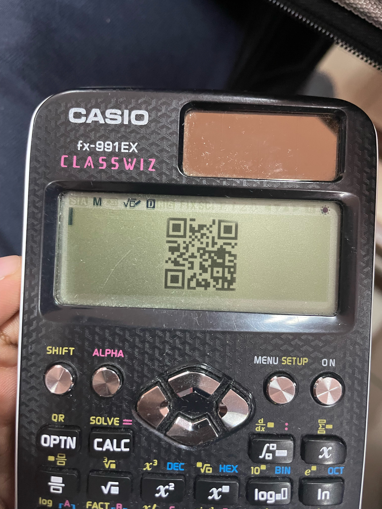
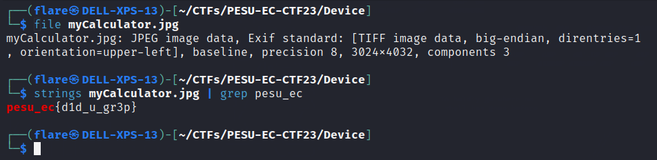

# Device
> Solves - 32

## Description
Where's the flag?

## Unreleased hints
1. some linux command(s) might help you find it. ps: search up the meaning of device :)

## Files Attached

## Solution

Step 1: Try scanning QR Code and get Rick rolled

Step 2: Try basic forensic techniques on image, such as `strings`, `grep`

>`$strings myCalculator.jpg | grep pesu_ec` 

## Flag
>`pesu_ec{d1d_u_gr3p}`

## Fun Fact
The challenge is both :)

