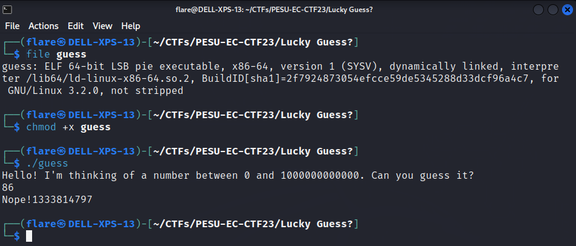
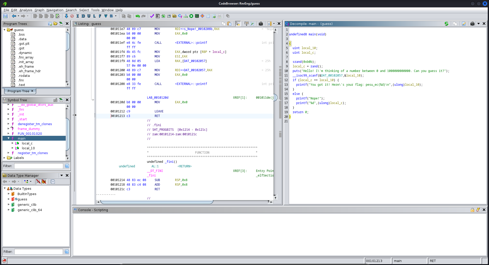
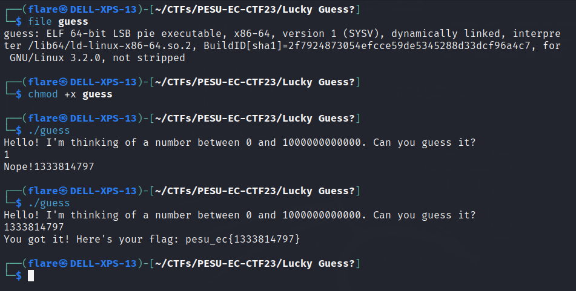
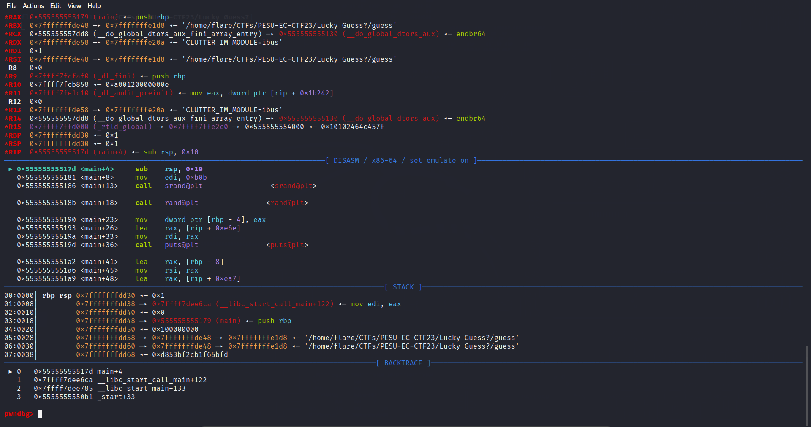
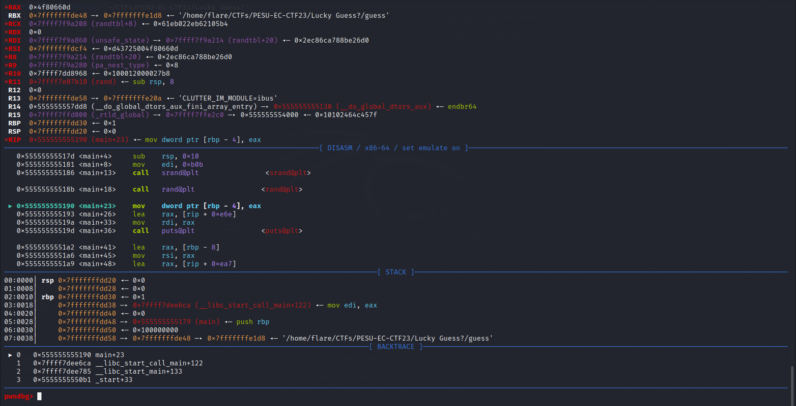
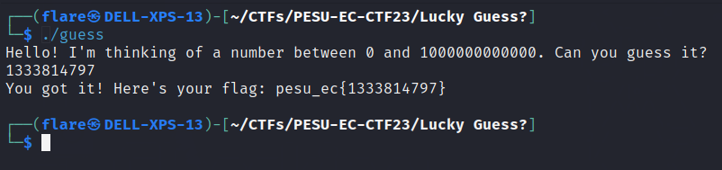

# Lucky Guess?
> Solves - 40

## Description
Care to take a guess? Or do you even need to?

## Files Attached
- [guess](./guess)

## Solution

### Unintended Solution
The incorrect file was provided, so the solution was easier than intended.

- Examine file type using `file`

- Found to be `ELF`, linux executable

- Give +x permissions to be able to run it

- Run the program

- Run the program more than once, understand program is always printing same number.

- Use Ghidra to decompile main function 

- Understand it is truly not random as the function srand is seed with `0xbob` and number printed is a constant number, or guess the random number recieved the previous execution as input.

### Intended Solution
The file should have not given any number.

- Examine file type using `file`

- Found to be `ELF`, linux executable

- Give +x permissions to be able to run it

- Run the program

- Use Ghidra to decompile main function 

- Understand it is truly not random as the function srand is seed with `0xbob`

- Using `gdb` tool (the one shown in image is gdb-peda), examine file - `gdb guess`

- Create a breakpoint at main - `b main`

- Run the program using `r`

- Step through instructions using `n` and stop when at intruction `0x555555555190 <main+23>    mov    dword ptr [rbp - 4], eax` (right after the number has been generated)

- Look at registers

- Observe RAX - `*RAX  0x4f80660d`

- Hex to Int gives, 0x4f80660d -> 1333814797

- Number is 1333814797

## Flag
>`pesu_ec{1333814797}`

