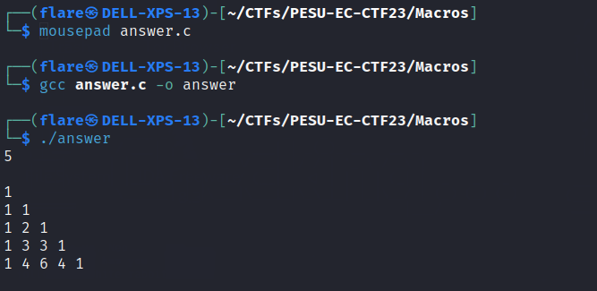

# Macros
> Solves - 73

## Description
Find out what the program is generating.

Flag format: ```pesu_ec{<string_with_underscore>}```

If the program is generating a diamond pattern:
```pesu_ec{diamond_pattern}```

## Files Attached
- [main.c](./main.c)

## Solution

- Through different observations, such as indentations, common tokens at ending (;), figure out and replace macros

- Or with the help chatGPT, etc., decode. (Assuming it ended more of a prompt engineering challenge)

- [answer.c](./answer.c)
- [substituted.c](./substituted.c)

- Compile and run and gigure out the pattern printed


- Identify pattern as `Pascal's Triange` (Some participants generalisec it and recognised it as a triangle pattern, a more specific name was required)

## Flags
>`pesu_ec{pascals_triangle}`
>`pesu_ec{pascal_triangle}`
>`pesu_ec{pascal's_triangle}`
>`pesu_ec{pascal's_triangle_pattern}`
>`pesu_ec{pascal_triangle_pattern}`
>`pesu_ec{pascals_triangle_pattern}`
