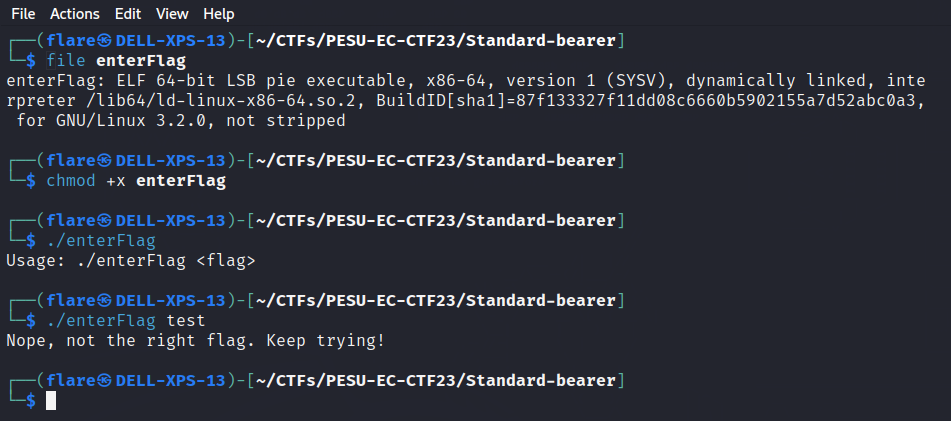
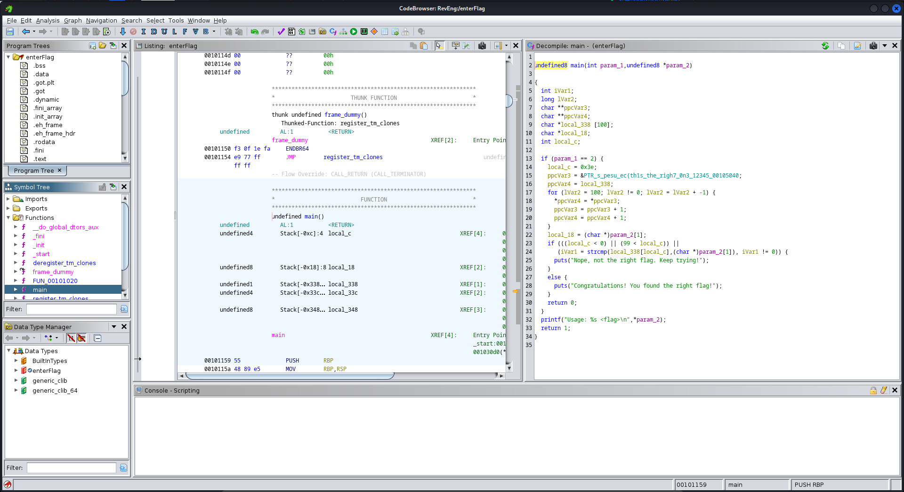
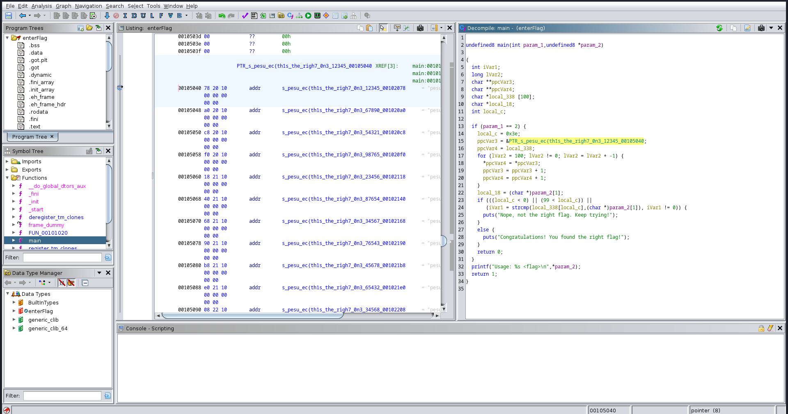
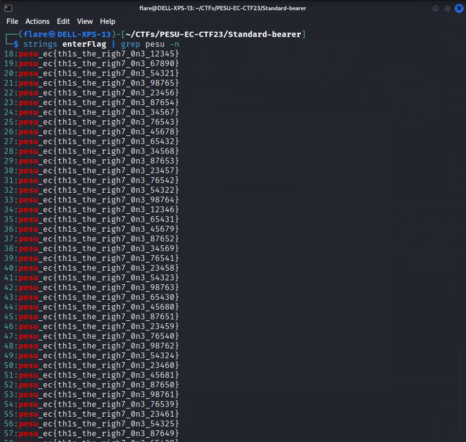
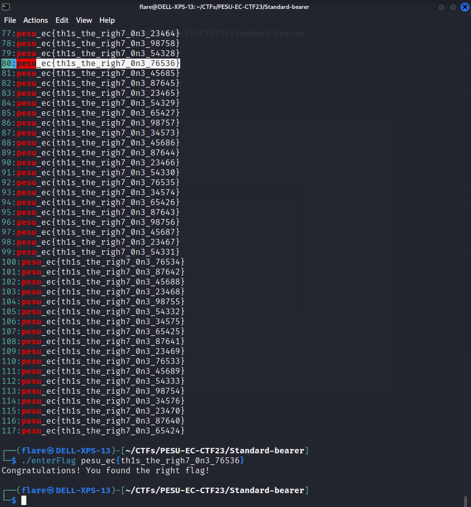

# Standard-bearer
> Solves - 28

## Description
Enter flag, okay?

## Files Attached
- [enterFlag](./enterFlag)

## Solution

- Examine file type using `file`

- Found to be `ELF`, linux executable

- Give +x permissions to be able to run it

- Run the program

### Pausible Approaches

#### Approach 1 (Scripting)
- On examining with common techniques such as 
`strings enterFlag | grep pesu`, multiple flags found

- Write a script to bruteforce through the list of strings

#### Approach 2 (Reverse Engineering)
- Analyze file with `ghidra`

- Find the list of strings

- Also on analyzing code, `local_c = 0x3e;`

- Converting from hex to int, 0x3e -> 62

- Remembering the fact lists start at index 0, the flag is the 63rd flag

- Manually find 63rd flag or using linux commands `strings enterFlag | grep pesu -n`

- First flag starts at line 18, so 18 + (63-1) = 80

## Flag
>`pesu_ec{th1s_the_righ7_0n3_76536}`

## Fun Fact
Standard-bearer - 
the person assigned to carry the standard, or flag, of a group, esp. of a military organization
