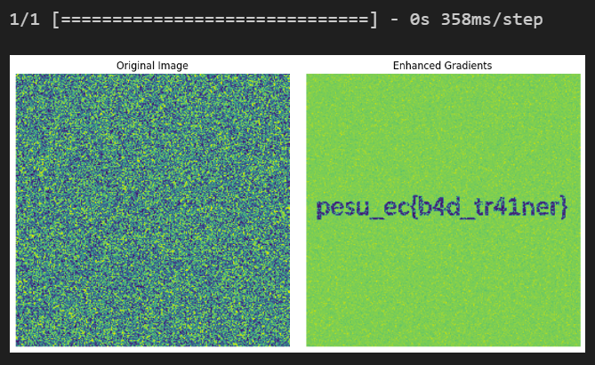

# To be flag or not to be
> Solves - 0

## Description
My model should be able to tell if an image is the flag or not.

## Hint
1. Free - Descents of the gradients

## Files Attached
- [Model](https://drive.google.com/file/d/1Uttp49MmPww5PprhJ11qy6i-DkZGcaJ9/view) 
- [classifier.ipynb](classifier.ipynb)

## Solution

- The notebook can be seen to traiing a network, on a randomly generated 256x256 image and the 256x256 flag image (in a single channel -Grayscale )

- The images are preprocessed in such a way each pixel is either black or white

- Going through [classifier.ipynb](classifier.ipynb), the network was found to be overfitting as based on accuracy and val_accuracy values seen when training and accuracy on evaluation.

- An approach to find the flag is to enhance the gradients.

- In a new notebook, create a random image and preprocessinf similar to as shown in the `classifier.ipynb` notebook 

- Enhance gradients using the preprocessed image and model and display it

## Flag
>`pesu_ec{b4d_tr41ner}`

## Fun Fact
This challenge took a while to create, but felt amazing when it worked out :) 
